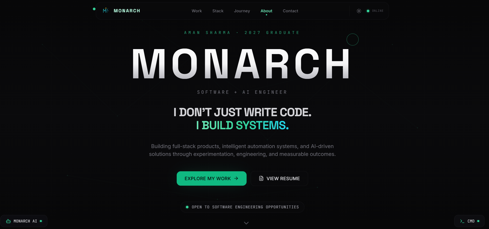
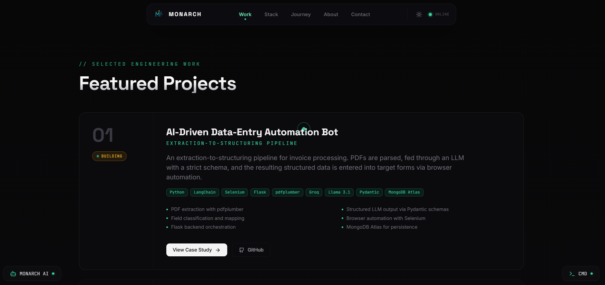
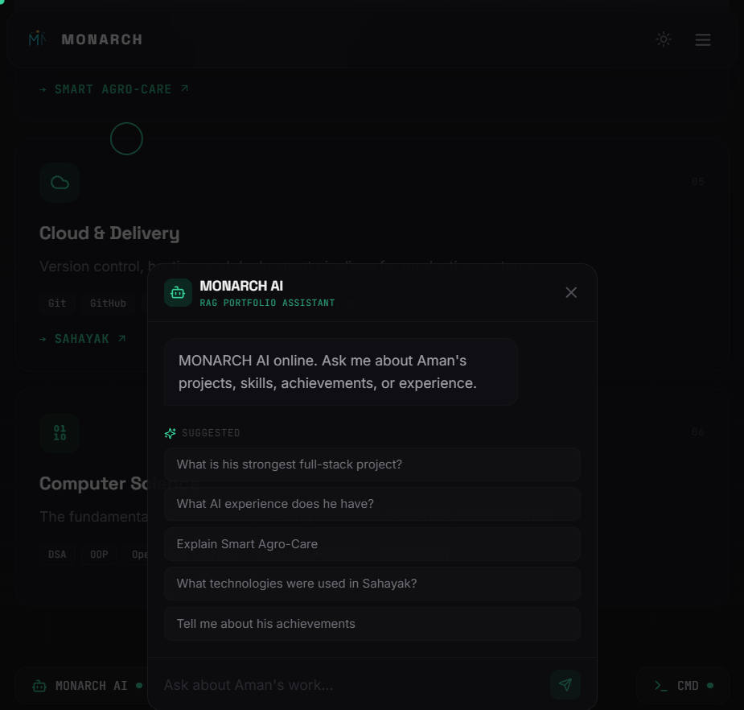
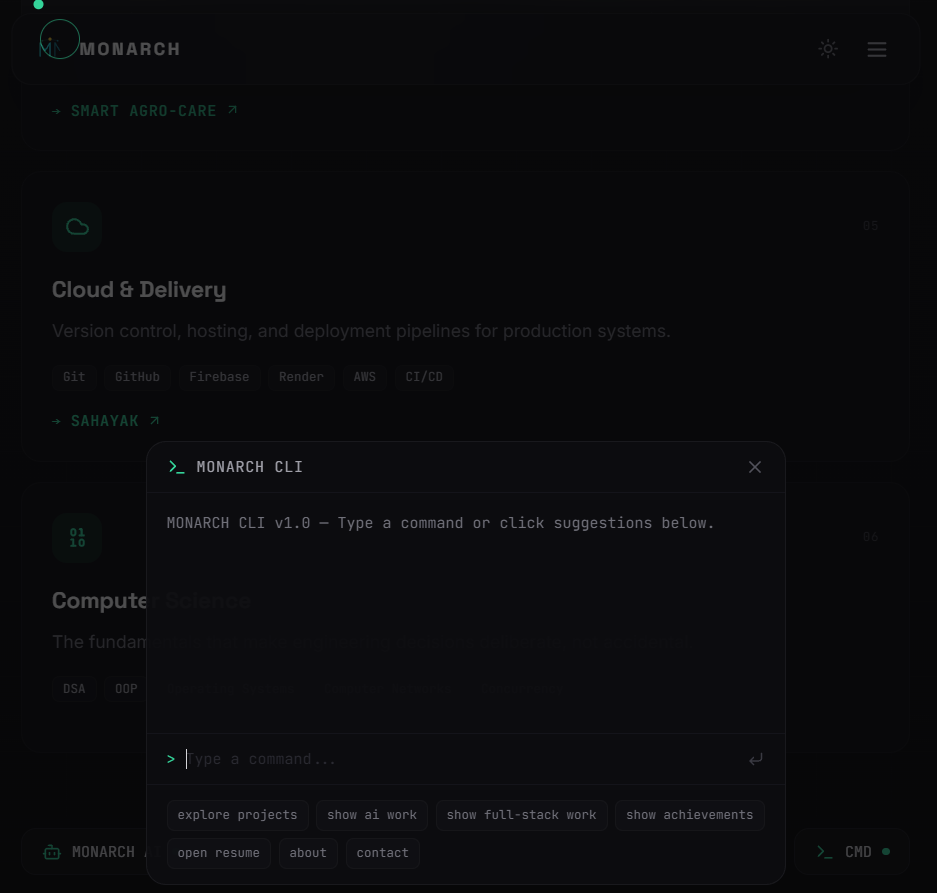

# MONARCH 👑

> **Software + AI Engineer Portfolio**

MONARCH is my personal portfolio website, built to showcase my work across **software engineering, full-stack development, AI, and intelligent automation**.

It is designed as more than a traditional portfolio — combining project showcases with interactive experiences such as **MONARCH AI** and **MONARCH CLI**.

## 🌐 Live Portfolio

**https://monarch-portfolio.onrender.com**

## ✨ Highlights

- Modern, responsive portfolio experience
- Featured software engineering and AI projects
- **MONARCH AI** — interactive portfolio assistant
- **MONARCH CLI** — terminal-style portfolio experience
- Project-focused presentation of technical work
- Skills, achievements, and engineering profile
- Responsive UI for desktop and mobile

## 📸 Screenshots

### MONARCH — Home



### Featured Projects



### MONARCH AI



### MONARCH CLI



## 🚀 Featured Projects

### AI-Driven Data-Entry Automation Bot
An intelligent automation pipeline for processing invoice data using **LLMs, structured validation, and browser automation**.

**Flow:** PDF invoice → LLM extraction/structuring → validated data → browser automation

### Sahayak
A full-stack **MERN e-commerce platform** with buyer and seller workflows, authentication, role-based access, validation, and data management.

### Smart Agro-Care
An **IoT + AI** project combining ESP32-based sensing with computer vision for agricultural applications.

## 🛠️ Tech Stack

- React
- TypeScript
- Vite
- Tailwind CSS
- JavaScript
- Lucide React
- ESLint
- Git & GitHub

## ⚙️ Getting Started

### 1. Clone the repository

```bash
git clone https://github.com/AmanSharrma00/monarch-portfolio.git
cd monarch-portfolio
```

### 2. Install dependencies

```bash
npm install
```

### 3. Start the development server

```bash
npm run dev
```

The local development server will be available at the URL shown by Vite.

## 📦 Available Scripts

| Command | Description |
|---|---|
| `npm run dev` | Start the Vite development server |
| `npm run build` | Build the project for production |
| `npm run preview` | Preview the production build locally |
| `npm run lint` | Run ESLint |
| `npm run typecheck` | Run TypeScript type checking |

## 📁 Project Structure

```text
monarch-portfolio/
├── public/
│   ├── ai.png
│   ├── cli.png
│   ├── homepage.png
│   ├── projects.png
│   ├── monarch-mark.svg
│   └── resume.pdf
├── src/
├── package.json
├── tsconfig.json
├── vite.config.ts
└── README.md
```

## 📌 Status

🟢 **Live and actively improving.**

MONARCH is an evolving portfolio project, with new improvements and experiments added over time.

## 🔗 Links

- **Portfolio:** https://monarch-portfolio.onrender.com
- **GitHub:** https://github.com/AmanSharrma00/monarch-portfolio

---

Built with curiosity, experimentation, and a focus on building real systems.
